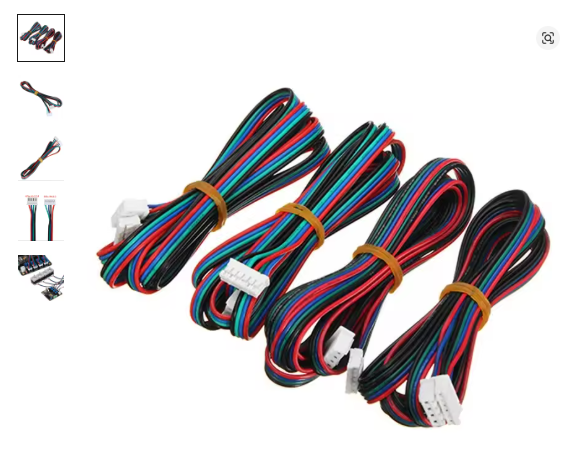
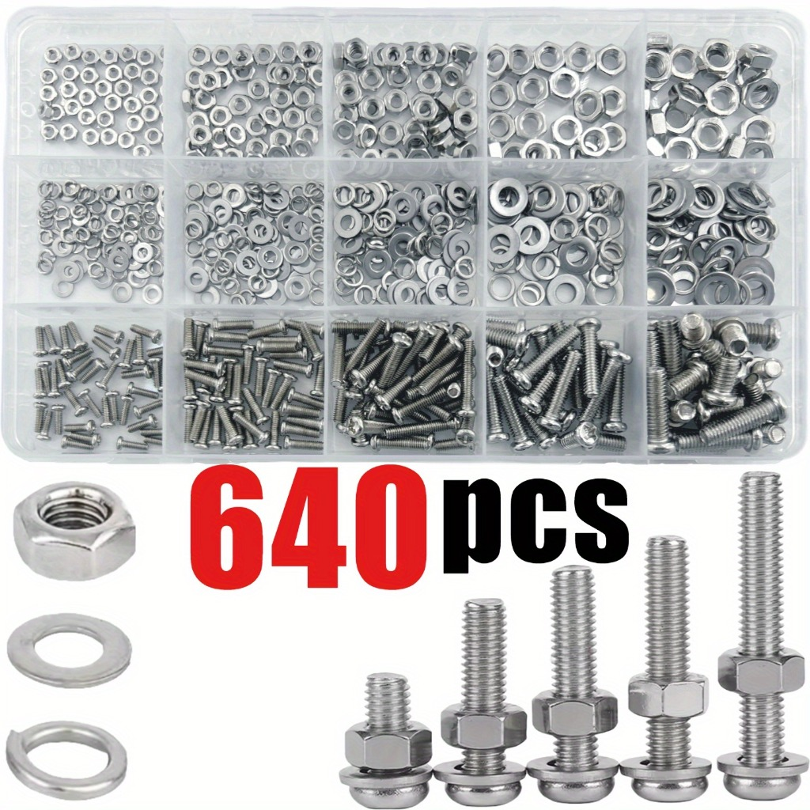
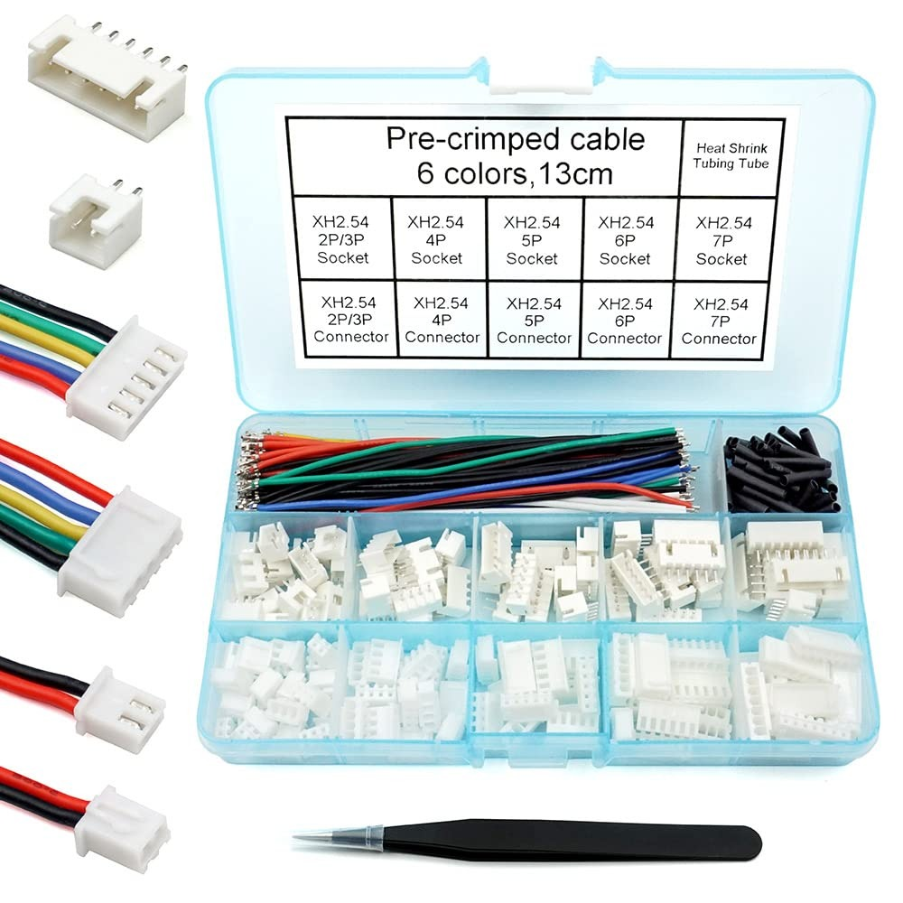
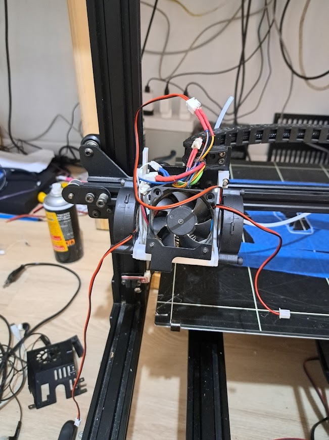
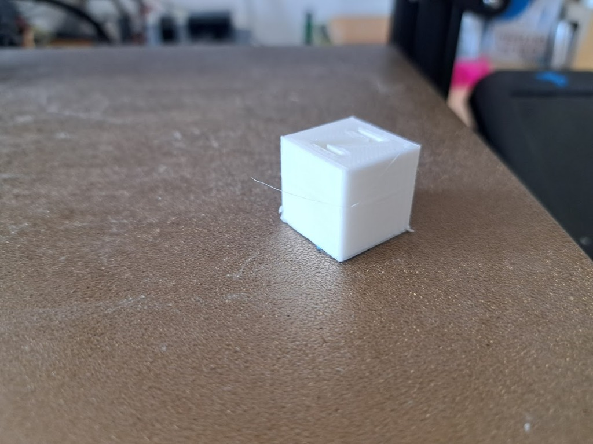

# Anycubic Chiron to BTT Octopus Pro Upgrade

This repository contains the Klipper configuration and documentation for upgrading an Anycubic Chiron 3D printer with a BigTreeTech (BTT) Octopus Pro motherboard.

## Overview

The Anycubic Chiron is a large-format 3D printer that benefits significantly from a control board upgrade. This project replaces the original Trigorilla 8-bit board with a powerful 32-bit BTT Octopus Pro (STM32H723), enabling smoother motion, quieter operation with TMC2209 drivers, and better expandability.

## Hardware Specifications

- **Printer:** Anycubic Chiron (400x400x450mm)
- **Control Board:** BigTreeTech Octopus Pro v1.1
- **MCU:** STM32H723xx
- **Stepper Drivers:** TMC2209 (UART mode)
- **Firmware:** Klipper

## Prerequisites & Bill of Materials

Before starting the upgrade, you must prepare the following components and printed parts.

### Required Printed Parts
1. **Octopus Board Mounting Plate:** You must print this plate to secure the new motherboard in the Chiron's base.
   - [Octopus Mounting Plate (Thingiverse)](https://www.thingiverse.com/thing:4922840)
2. **Upgraded Print Head Carriage:** Required for better cooling and direct wiring.
   - [Anycubic Chiron Print Head Upgrade (Thingiverse)](https://www.thingiverse.com/thing:3621886)

### Required Hardware & Supplies
To complete the rewiring and print head upgrade, you will need:
- **Fans:** 60 mm fans for the print head and electronics cooling.
- **Wiring:** High-quality wires and long stepper motor extension wires.
- **Connectors:** JST-XH 2.54mm connector kit for all board connections.
- **Fasteners:** A comprehensive set of **M3**, M4, and M5 screws, nuts, and washers.
  - **Important:** The print head upgrade specifically requires M3 bolts. It is highly advised to purchase a kit with **different sizes** (lengths) to ensure you have the right fit for every component and any future adjustments.

| Stepper Wires | Connector Kit | Screw Kit |
| :---: | :---: | :---: |
|  |  |  |

## Major Modifications & Rewiring

The upgrade involved a complete overhaul of the printer's electrical system to improve reliability and simplify the signal path.

### 1. Direct Wiring (Bypassing the Print Head Sub-board)
The original Chiron uses a sub-board on the print head to distribute signals. To minimize points of failure and signal noise, this sub-board was **cancelled**. All components (extruder motor, hotend heater, fans, and sensors) are now wired **directly** back to the Octopus Pro board.

### 2. Bed Heating Sub-board Retention
Unlike the print head, the **bed heating sub-board was retained**. This board handles the high current required for the Chiron's massive heated bed, acting as an secondary relay/distribution point that integrates well with the new setup.

### 3. Power Supply Consolidation
The original setup included a small 24V converter/power supply alongside the main unit. This smaller unit has been **removed**. The printer now runs exclusively off the **massive main power supply**. 
- **Why?** The Octopus Pro board features robust power management and can handle the logic and motor power distribution directly from the primary 24V source. Removing the redundant converter simplifies the wiring, reduces heat, and eliminates a potential point of failure.

## Hardware Photos

Below are the photos of the final installation.

### Upgraded Print Head

*The upgraded print head carriage with improved part cooling (60mm fans).*

### Board Installation

*The Octopus Pro board mounted using the custom 3D printed plate.*

### Component Wiring

*Detail of the direct wiring path and JST-XH connector terminations.*

### Cooling System

*The custom fan arrangement for keeping the TMC2209 drivers cool.*

## Printing Recommendations

Due to the massive size and weight of the Chiron's heated bed and carriage, it is essential to print at conservative speeds to prevent layer shifts.
- **Print Speed:** 50 mm/s
- **Acceleration:** 100 mm/s²
- *Note: I may try to increase acceleration gradually in the future, but these settings provide high reliability.*

## Final XYZ Calibration Print

*Recent XYZ calibration cube showing excellent layer consistency and dimensional accuracy.*

## Configuration Features

- **Dual Z-Axis:** Utilizes two stepper drivers for the Z-axis with independent endstops for automatic leveling.
- **TMC2209 UART:** Full software control over motor current and microstepping.
- **Optimized Macros:** Custom G-code macros for pausing, resuming, and cancelling prints.

## How to Use

1. Flash the Octopus Pro with the generated Klipper firmware (`klipper.bin`).
2. Upload `printer.cfg` to your Klipper host (e.g., Raspberry Pi running Mainsail/Fluidd).
3. Calibrate your Z-offset and Bed Mesh for the large Chiron build plate.

---
*Created as part of the Anycubic Chiron Octopus Upgrade project.*
