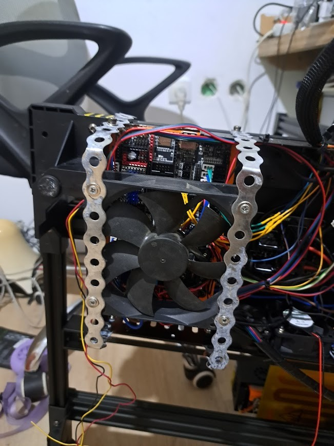
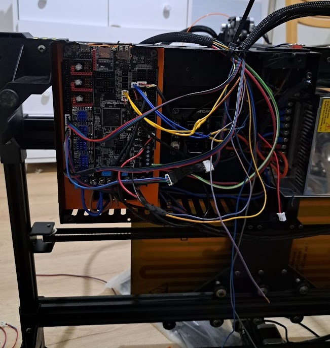

# Anycubic Chiron to BTT Octopus Pro Upgrade

This repository contains the Klipper configuration and documentation for upgrading an Anycubic Chiron 3D printer with a BigTreeTech (BTT) Octopus Pro motherboard.

## Overview

The Anycubic Chiron is a large-format 3D printer that benefits significantly from a control board upgrade. This project replaces the original Trigorilla 8-bit board with a powerful 32-bit BTT Octopus Pro (STM32H723), enabling smoother motion, quieter operation with TMC2209 drivers, and better expandability.

## Hardware Specifications

- **Printer:** Anycubic Chiron (400x400x450mm)
- **Control Board:** BigTreeTech Octopus Pro v1.1
- **MCU:** STM32H723xx
- **Stepper Drivers:** TMC2209 (UART mode)
- **Firmware:** Klipper

## Major Modifications & Rewiring

The upgrade involved a complete overhaul of the printer's electrical system to improve reliability and simplify the signal path.

### 1. Direct Wiring (Bypassing the Print Head Sub-board)
The original Chiron uses a sub-board on the print head to distribute signals. To minimize points of failure and signal noise, this sub-board was **cancelled**. All components (extruder motor, hotend heater, fans, and sensors) are now wired **directly** back to the Octopus Pro board.

### 2. Bed Heating Sub-board Retention
Unlike the print head, the **bed heating sub-board was retained**. This board handles the high current required for the Chiron's massive heated bed, acting as an secondary relay/distribution point that integrates well with the new setup.

### 3. Power Supply Consolidation
The original setup included a small 24V converter/power supply alongside the main unit. This smaller unit has been **removed**. The printer now runs exclusively off the **massive main power supply**. 
- **Why?** The Octopus Pro board features robust power management and can handle the logic and motor power distribution directly from the primary 24V source. Removing the redundant converter simplifies the wiring, reduces heat, and eliminates a potential point of failure.

## Wiring Photos

Below are the photos of the Octopus Pro board installation and the consolidated power setup.

### Board Installation

*The Octopus Pro board mounted in the electronics compartment with direct wiring to the print head.*

### Component Wiring

*Detail of the motor and heater connections, showing the direct home-run wiring.*

### Cooling and Power

*The consolidated cooling arrangement (large fan with custom mounting) and the simplified 24V power entry.*

## Configuration Features

- **Dual Z-Axis:** Utilizes two stepper drivers for the Z-axis with independent endstops for automatic leveling.
- **TMC2209 UART:** Full software control over motor current and microstepping.
- **Optimized Macros:** Custom G-code macros for pausing, resuming, and cancelling prints.

## How to Use

1. Flash the Octopus Pro with the generated Klipper firmware (`klipper.bin`).
2. Upload `printer.cfg` to your Klipper host (e.g., Raspberry Pi running Mainsail/Fluidd).
3. Calibrate your Z-offset and Bed Mesh for the large Chiron build plate.

---
*Created as part of the Anycubic Chiron Octopus Upgrade project.*
